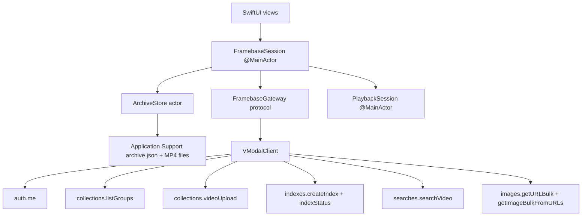

# Framebase Apple application — development plan

Date: 2026-09-19

Version: 1.0

## User Specs

- Build a native Swift version of the Flutter Framebase application in
  `uinterface/sdk_flutter/example/05_framebase`.
- Place the independent Apple application in
  `uinterface/sdk_swift_apple/example/05_framebase`.
- Preserve the Flutter application's complete behavior, visible hierarchy,
  copy, bundled media, and data contracts.
- Use SwiftUI, AVFoundation/AVKit, the existing `VModalSDK` Swift package, and
  Apple lifecycle and file APIs. The application must not depend on Flutter at
  build time or runtime.
- Support iPhone and iPad on iOS 16 or later, matching the deployment target and
  Swift 6 strict-concurrency settings of the existing `StarterIOS` example.

--------------------------------------------------------------

## Scope

The Swift app must implement the complete Framebase workflow:

1. Show the same three bundled street recordings in the same order.
2. Import one additional MP4 at a time through the system file importer.
3. Accept a VModal API key at runtime and authenticate with `auth.me()`.
4. Discover whether `framebase_streets` has a ready image index.
5. Upload pending local recordings sequentially with progress and cancellation.
6. Create a visual index, poll it to a terminal state, and resume a persisted
   pending job after polling is stopped or the app is relaunched.
7. Search indexed video frames using natural language and focused or loose
   distance cutoffs.
8. Resolve frame images in bulk without changing ranked search order, group
   nearby moments by source recording, and preserve partial image failures.
9. Play the app-private local source video at the returned timestamp and seek
   among other matching moments.
10. Persist non-secret archive state and a newest-first, bounded sync history.

### Out of scope

- No SDK route changes, hand-written HTTP client, or duplicate API models.
- No Clerk UI, registration, billing, collection picker, or configurable remote
  collection and stream.
- No remote or local deletion, remote video playback, background uploads,
  background polling, pagination, TEXT/AUDIO search, or image-query UI.
- No API-key, signed-locator, search-response, or downloaded-frame persistence.
- No redesign into a dashboard, tab bar, split-view form, or the
  `StarterIOS` sample interface.
- No pixel-perfect snapshot gate. Automated semantic/layout checks and manual
  comparison with the three Flutter reference screenshots are required.

## Sources of truth and components to reuse

### Product behavior

- `sdk_flutter/example/05_framebase/lib/main.dart` is the source of truth for
  navigation, screen states, visible copy, visual tokens, grouping, and playback.
- `sdk_flutter/example/05_framebase/lib/data/archive_controller.dart` is the
  source of truth for persistence, account changes, upload/index sequencing,
  cancellation, and history.
- `sdk_flutter/example/05_framebase/lib/data/search_gateway.dart` is the source
  of truth for remote scope, search cutoffs, filename/timestamp normalization,
  image correlation, and safe error messages.
- `sdk_flutter/example/05_framebase/test/` defines the minimum behavior and
  mapping cases that the Swift tests must preserve.
- `sdk_flutter/example/05_framebase/readme_assets/{library,search,playback}.png`
  are the visual references.
- `sdk_android/examples/05_framebase/00_specs.md` is a secondary parity
  checklist. Reuse its platform-neutral contracts, especially the ranked-image
  join, account-bound state, and cancellation rules.

### Swift implementation

- Reuse the local Swift package reference and core Xcode project settings from
  `sdk_swift_apple/example/StarterIOS`:
  - iOS 16 minimum;
  - iPhone and iPad device families;
  - Swift 6;
  - complete strict-concurrency checking;
  - unsigned simulator builds.
- Use `MutableAPIKeyProvider`, `SDKConfig`, `VModalClient`, `UploadSource`,
  `UploadTask`, `CancellationToken`, and the typed resources already exposed by
  `VModalSDK`.
- Instantiate `VModalClient` directly for this example. Do not use
  `VModal.configure(projectID:)` or `VModalScope`, because `ContentScope` encodes
  a project prefix into the backend collection name. Framebase must address the
  existing raw collection name `framebase_streets` exactly.
- Reuse `StarterIOS` shell integration patterns, then add explicit Framebase
  build/run/test commands. Do not make the existing starter commands ambiguous.
- Use Apple frameworks only for the app layer: SwiftUI, Foundation,
  UniformTypeIdentifiers, AVFoundation, AVKit, and XCTest/XCUITest.

### Media reuse

Copy the exact files; do not transcode, rename, or generate substitutes:

- `assets/videos/neighborhood_crossing.mp4`
- `assets/videos/downtown_traffic.mp4`
- `assets/videos/evening_junction.mp4`
- `assets/stills/neighborhood_crossing.jpg`
- `assets/stills/downtown_traffic.jpg`
- `assets/stills/evening_junction.jpg`
- `assets/fonts/InstrumentSans.ttf`
- `assets/fonts/OFL.txt`
- `MEDIA_SOURCES.md`

Keep the media provenance and Pexels links synchronized with the Flutter copy.
Package the font as an app resource and declare it through `UIAppFonts`. Package
the videos and stills with stable resource names that map one-to-one to the
Flutter filenames.

## Critical invariant

### Fixed remote scope

Every upload, group lookup, index request, search, and image lookup uses:

```text
mode:       vid_file
collection: framebase_streets
stream:     street_study
```

Index creation additionally uses `index_type=vid_img_emb`,
`modality=vid_img_emb`, and `re_process=true`. Image lookup uses
`modality=vid_img`. Search uses only the image source. No UI input may alter
this scope.

### Ranked search and image coupling

The search response owns result order and metadata. Bulk image results are a
derived lookup and must never reorder hits, change the backend total, attach an
image to a different timestamp, or become a stable result identifier.


The implementation must:

1. Preserve accepted search-row order.
2. Build exactly one ordered image candidate per accepted row.
3. Validate `input_index`, bounds, duplicates, `found`, and locator shape.
4. Let the first valid response record win for a candidate index.
5. Correlate downloaded content without changing search order.
6. Keep a match when its URL is missing or its base64 payload is invalid.

### Local playback ownership

Playback always uses an app-private file URL. Copy a bundled MP4 from the app
bundle on first play/upload. Copy an imported file into Application Support
while its security-scoped URL is valid. Never persist an external picker URL.
A result for an unknown or missing local recording remains visible and reports
that playback is unavailable on this device.

### Secret and ephemeral-data boundary

The API key exists only in the settings field until submission and then inside
`MutableAPIKeyProvider`. It must not enter observable app state, scene storage,
UserDefaults, Keychain, archive JSON, logs, errors, test fixtures, accessibility
labels, or crash text.

Search rows, signed locators, downloaded frame bytes, SDK clients, upload
handles, cancellation tokens, tasks, and player state are also ephemeral.
Persist only the fields listed in the persistence contract below.

### App architecture



`FramebaseSession` owns presentation state and task generations. `ArchiveStore`
owns serialized disk access. `SDKFramebaseGateway` owns the provider and client.
Views render state and send user intents; they do not construct API requests or
write archive JSON.

## Data Contract

### `ArchiveClip`

Use a `Codable`, `Identifiable`, `Sendable`, equatable value type.

| Field | Swift type | Contract |
| --- | --- | --- |
| `id` | `String` | Stable local ID and bundled filename stem. |
| `title` | `String` | User-facing title. |
| `location` | `String` | `City · qualifier`; cards show the city portion. |
| `durationSeconds` | `Double` | Finite and non-negative. |
| `videoResource` | `String?` | Bundled MP4 resource stem. |
| `posterResource` | `String?` | Bundled JPG resource stem; nil for imports. |
| `localRelativePath` | `String?` | Relative path below the Framebase support directory. |
| `uploaded` | `Bool` | Upload completed for the persisted `accountID`. |
| `bundled` | `Bool` | Bundled clips remain restorable before local copy. |

`remoteFilename` is `id + ".mp4"`. Resolve `localRelativePath` under the known
Framebase support directory; do not persist an unrestricted absolute path.
Filename matching is case-insensitive and accepts the ID, exact remote filename,
or a returned name beginning with `id + "."`.

The defaults must match Flutter exactly:

| ID | Title | Location | Duration |
| --- | --- | --- | ---: |
| `neighborhood_crossing` | Neighborhood crossing | San Francisco · Daylight | 55.2 s |
| `downtown_traffic` | Downtown traffic | Singapore · Afternoon | 15.8 s |
| `evening_junction` | Evening junction | Mexico City · Dusk | 75.0 s |

Imported IDs use `street_{epoch_milliseconds}`. The title is the selected
file's display name, location is `Imported recording`, `bundled=false`, and
`uploaded=false`.

### `ArchiveEvent`

Fields are `title`, `detail`, `isError`, and ISO-8601 `time`. Insert newest
first and retain at most 40. Details may include phase, count, file display name,
size, and duration. They must not contain credentials, headers, signed locators,
raw server bodies, or file-system paths.

### `FrameMatch`

`FrameMatch` is `Identifiable` and `Sendable` and contains:

- an ephemeral `[String: JSONValue]` raw row;
- normalized filename;
- normalized 13-digit timestamp;
- optional local playback seconds;
- optional frame `Data`;
- optional absolute HTTPS fallback URL;
- distance read from raw `score`.

Its in-memory ID must be generated from the search generation and ranked row
position. Do not use image-response order or a signed locator as identity.

### `SearchBatch`

Keep these values independently:

- `matches`: client-accepted rows, including missing images;
- `total`: backend `cntTotal`, unchanged after client filtering;
- `serverMilliseconds`: backend `executionTimeMs`;
- `roundTripMilliseconds`: elapsed time through the search response;
- `imageMilliseconds`: URL and byte retrieval time after search.

### Filename normalization

Use the first nonblank value from:

```text
filename
filename_sanitized
video_filename
video
source_path
path
title
```

Normalize slash direction and retain the basename. When none exists, derive a
name from `item_id` by removing a leading `<stream>-` and trailing
`-<timestamp>`. Reject a row if the resulting filename is empty.

### Timestamp and playback normalization

For image lookup, read `ts_unix_13digits`, `ts_unix`, then `timestamp_ms`:

- reject nonnumeric, nonfinite, or negative values;
- keep the first 13 digits when the integer has at least 13 digits;
- multiply a 10-digit seconds value by 1000;
- left-pad other shorter integers to 13 digits.

For playback, prefer the first finite, nonnegative numeric value from:

```text
video_time_seconds
timestamp_seconds
time_seconds
start_seconds
offset_seconds
seconds
time_sec
```

Otherwise interpret the timestamp as relative milliseconds only when it is
less than `86_400_000`. Never interpret epoch-like values as a local offset.
Seek only when the requested position is at or before the local asset duration.

### Search request

Call the typed Swift SDK with:

```swift
SearchRequest(
    queryText: query,
    mode: "vid_file",
    groupName: "framebase_streets",
    streamName: "street_study",
    searchSources: ["image"],
    limit: 30,
    imageEmbScoreMin: maxDistance,
    versionLancedb: indexVersion
)
```

Focused mode uses `maxDistance=0.85`; **Include looser matches** uses `1.5`.
Distance is similarity distance, not confidence. Defensively retain only rows
with a usable filename and finite `score <= maxDistance` before image lookup.

### Bulk frame lookup

Each `getURLBulk` record contains:

```text
mode = vid_file
group_name = framebase_streets
modality = vid_img
stream_name = row stream_name/stream, otherwise street_study
filename = normalized filename
ts_unix_13digits = normalized timestamp, when present
```

- Skip both image calls when there are no accepted rows.
- Accept `input_index` as an integer, integral finite number, or numeric string.
- When absent, use the response record position only if it is in bounds.
- Reject negative, malformed, out-of-range, duplicate, or `found=false` rows.
- Accept absolute HTTPS locators and relative locators whose path is exactly
  `/api/external/v1/image/get_image`.
- Send accepted locators through `getImageBulkFromURLs`; do not perform an
  ordinary GET for a relative POST locator.
- Base64 decode failure produces a placeholder for that match only.

### Index lifecycle

Create the index with the typed request:

```swift
IndexationSubmitRequest(
    mode: "vid_file",
    groupName: "framebase_streets",
    streamName: "street_study",
    indexType: "vid_img_emb",
    modality: "vid_img_emb",
    reProcess: true
)
```

Persist a nonblank returned job ID before polling. Poll every four seconds for
at most 120 attempts. Successful terminal states are `success`, `succeeded`,
`done`, `completed`, and `ok`. Failed states are `failed`, `failure`, `error`,
`cancelled`, and `canceled`, case-insensitively.

Stopping local polling does not cancel server work. Keep the job ID for Resume.
On success, call `listGroups(mode: "vid_file")`, select
`findGroup("framebase_streets", mode: "vid_file")?.latestLancedbVersion`, clear
the pending job, and persist. On server failure, clear and persist the job. On
timeout, retain it and show the resumable message.

### Persistence

`ArchiveStore` writes `Application Support/Framebase/archive.json` atomically by
writing a sibling temporary file and replacing/moving it. As an actor, it
serializes load, save, media-copy, and import-copy operations.

Persist only:

```text
clips
pendingJobID
accountID
events (maximum 40)
```

Do not persist index version; rediscover it on every connection. Do not persist
connection state, active query, search batch, cutoff selection, player state,
API key/provider, locators, frame bytes, cancellation handles, or tasks.

On restore, remove a nonbundled clip whose relative local file is missing. If
decoding fails or no valid clips remain, restore the three bundled clips and
show a bounded local-restore notice. A save failure must not cancel network work.

After successful authentication, if the saved `accountID` is nonblank and
differs from the new nonblank user ID, set all `uploaded` flags to false and
clear the pending job and history. On first connection, retain local pre-connect
history and save the authenticated account ID.

## State and lifecycle contract

`@MainActor final class FramebaseSession: ObservableObject` owns one coherent
published `FramebaseState`. Keep credentials, SDK objects, tasks, and tokens as
private non-state properties.

The state must distinguish:

- local initialization;
- disconnected, connecting, connected without index, and search-ready;
- uploading with determinate/indeterminate progress;
- creating and polling an index;
- stopped polling with a resumable job;
- searching and canceling search;
- suggestions, empty accepted results, grouped results, and sanitized error;
- playback loading, ready, play/pause, seeking, and local-open failure.

Use separate preparation and search tasks, SDK cancellation tokens, and integer
generations. Editing the query, toggling cutoff, disconnecting/replacing a key,
importing a recording, beginning preparation, or destroying the session must
invalidate search immediately. A canceled or stale generation cannot publish a
batch, error, notice, or busy flag.

For each upload, retain its `UploadTask`, consume `progress` in one child task,
and await `result` in the preparation task. Mark a clip uploaded only when the
result has `uploaded == true`. Cancellation preserves completed uploads and
calls `UploadTask.cancel()` for the active clip.

`disconnect()` cancels search/preparation, closes the client, and clears the
provider. Replacing a connection validates the new client first, swaps it only
after success, then closes the old client. Session teardown cancels local tasks,
cancels the active upload/token, and schedules gateway close. Playback owns and
removes its AVPlayer periodic observer and pauses/releases the player when its
sheet disappears.

## Screen and interaction specification

### Theme

- Fixed light presentation.
- Instrument Sans throughout.
- Paper `#ECE9E2`; ink `#252C29`; accent/rust `#AA4F2D`;
  secondary `#706F67`; search field `#DFDCD4`.
- Use safe-area insets and dark status-bar content.
- Use SwiftUI material only for the toolbar and overlays. A translucent fallback
  must keep adequate contrast if material rendering changes.
- Every primary action, video card, frame, close control, playback control, and
  cancel action needs a stable accessibility identifier and descriptive label.
- Support a 320-point viewport, Dynamic Type through accessibility sizes,
  portrait and landscape, and iPad widths without obscuring actions.

### Library

- Frosted/transparent toolbar with the Framebase mark and title, add button,
  and overflow menu.
- Header: **Street footage** and `<N> videos`.
- Rounded 1.8:1 poster cards in archive order, with duration at top-right, title
  and city at bottom-left, and play control at bottom-right.
- Imported files without a poster show a neutral movie placeholder.
- Selecting a local card opens playback at zero.
- Add presents `fileImporter` restricted to MPEG-4 movies. Accept a playable,
  nonempty MP4 no larger than 100 MiB, copy it while security-scoped access is
  active, obtain duration asynchronously through `AVURLAsset`, and display the
  Flutter success/failure text.
- Overflow items, in order: **Search settings**, **Prepare videos for search**,
  **Sync history**.
- Show one preparation status block while active. Show **Prepare videos for
  search** when connected without an index and **Prepare added videos** when a
  ready archive contains a pending import.
- The floating dark dock reads **Search your videos** and opens Search.
- Do not add a permanent tab bar, connection chip, collection badge, activity
  dashboard, or raw SDK statistics.

### Search settings sheet

- Title **Search settings** and the same connected/disconnected explanatory copy.
- A `SecureField` labeled **API key**, with autocorrection, capitalization,
  suggestions, and credential persistence disabled as far as SwiftUI permits.
- Clear the bound field before authentication begins.
- **Connect** calls `auth.me()` and then version discovery; dismiss only after
  success. **Disconnect** appears when connected.
- Disable connection actions during connection or preparation.
- Render only sanitized errors and never echo input or SDK raw bodies.

### Preparation and status

- If disconnected, Prepare first opens Search settings.
- If a pending job exists, Resume starts polling without an upload confirmation.
- Otherwise show **Prepare videos for search?** with the exact count/rebuild
  explanation and **Cancel** / **Prepare** actions.
- Upload status shows determinate progress when total bytes are known. Index
  creation/polling uses indeterminate progress and elapsed seconds.
- Before a job ID exists, the action is **Cancel**. After it exists, the action
  is **Stop waiting** and retains the job.
- Poll timeout text is **Still processing. Use Resume to check the server job
  again.**

### Search

- Search field has back, editable query, search/cancel, and overflow controls.
- Initial suggestions, in order:
  - **People crossing the street**
  - **A bus on a city street**
  - **Cars at an intersection**
- Submission while disconnected opens settings; submission without an index
  enters preparation rather than sending search.
- Search options contain **Include looser matches** and **Search details**.
- Changing query or cutoff clears current results immediately.
- Focused empty results show **No matching moments**, **Try a different
  description.**, and **Include looser matches**.
- Group accepted matches by normalized filename in first-seen ranked order.
  Within a recording, omit a later hit when it is less than six seconds from an
  already retained hit. Preserve relevance order; do not sort by timestamp.
- Show two columns below 600 points and three at/above 600. Initially show two
  moments per recording, then **Show N more moments** / **Show fewer moments**.
- Unknown local source rows remain visible with **Not stored on this device**;
  selecting one shows the same playback-unavailable message as Flutter.
- Search details show raw server count, accepted count, request time, server
  execution time, and frame retrieval time, plus the distance/grouping note.

### Playback sheet

- Present title, city, close button, rounded local video, and custom overlay
  controls matching the Flutter hierarchy.
- Show loading over the poster until the local file and `AVPlayerItem` are ready.
- Seek to a valid selected match before exposing ready state.
- Controls include play/pause, scrubber, and `current / duration` labels with
  tabular digits.
- When multiple grouped moments exist, show a horizontal **Other moments** row.
  Selecting a moment seeks the same player; the active moment receives the rust
  border when current playback is within three seconds.
- Pause and release all observations on dismissal. Never create a remote player.

### Sync history

- Use a separate navigation destination titled **Sync history**.
- Show active work status when preparation is running.
- Empty copy is **No uploads or searches yet.**
- Otherwise render newest-first events with check/error icons, title, and detail.

## Error behavior

- Authentication failures: **Authentication failed. Check your API key and beta
  access.**
- Missing/unreadable local source: **The local video could not be read. Import it
  again.**
- Generic network/SDK failure: **The operation could not finish. Check the
  connection and try again.**
- Import failure: **Choose a playable MP4 smaller than 100 MB.**
- Playback failure: **This video could not be opened.**
- Canceling search because a newer query owns the screen is silent.
- Canceling upload retains earlier completed uploads and records one stopped event.
- Stopping index polling retains the job and explains that server work continues.
- One malformed frame URL or base64 payload affects only that frame.
- Corrupt archive state falls back to bundled clips and does not prevent launch.

Do not catch programmer errors only to hide them. Convert expected I/O, SDK,
media, and cancellation failures at store/gateway/session boundaries.

## List of potential failure issues

- Using `VModalScope` silently changes `framebase_streets` to a project-prefixed
  backend name.
- Copying Flutter request dictionaries bypasses typed SDK validation and drifts
  from the Swift API.
- Joining bulk images against raw rows after filtering attaches an image to the
  wrong video or timestamp.
- Treating a relative image locator as a GET URL fails against the gateway.
- A malformed/duplicate/out-of-order image row clears all results instead of one.
- An epoch timestamp becomes a playback offset and seeks beyond duration.
- An old search publishes after query, cutoff, key, account, import, or index
  state has changed.
- Swift task cancellation is assumed to cancel the SDK token/upload even though
  the explicit handle was not canceled.
- Stopping polling clears `pendingJobID`, making a running server job impossible
  to resume.
- Concurrent archive writes truncate JSON or a failed optional save cancels an
  active upload.
- A picker URL is persisted after security-scoped access ends.
- Bundle media is repeatedly loaded fully into memory instead of copied once and
  streamed through `UploadSource(fileURL:)`.
- `AVPlayer` time observers or playback survive sheet dismissal.
- Fixed card/control sizes clip text at 320 points or large Dynamic Type.
- The Xcode project omits media/font resources or accidentally packages a local
  key/configuration file.
- A new build command replaces `StarterIOS` coverage instead of adding a
  namespaced Framebase gate.

------------------------------------------------------------------------

## List of files to create or change

### New example

- `sdk_swift_apple/example/05_framebase/Framebase.xcodeproj/project.pbxproj` —
  independent iOS app/test targets, local `VModalSDK` package reference,
  resources, iOS 16, Swift 6, and strict concurrency.
- `sdk_swift_apple/example/05_framebase/Framebase/FramebaseApp.swift` — app
  entry point, fixed light appearance, session ownership, and root navigation.
- `sdk_swift_apple/example/05_framebase/Framebase/Info.plist` — standard app
  metadata plus the `UIAppFonts` array for Instrument Sans.
- `sdk_swift_apple/example/05_framebase/Framebase/FramebaseModels.swift` —
  archive/event/search/state value types and pure mapping/grouping helpers.
- `sdk_swift_apple/example/05_framebase/Framebase/ArchiveStore.swift` — atomic
  Codable persistence, bundled copy, imported-file copy, and relative-path
  resolution.
- `sdk_swift_apple/example/05_framebase/Framebase/FramebaseGateway.swift` —
  small injectable protocol and `SDKFramebaseGateway` using typed SDK resources.
- `sdk_swift_apple/example/05_framebase/Framebase/FramebaseSession.swift` —
  observable state, connection, import, upload/index, polling, search,
  generations, history, error conversion, and cleanup.
- `sdk_swift_apple/example/05_framebase/Framebase/FramebaseTheme.swift` — colors,
  Instrument Sans helpers, brand mark, material surfaces, badges, placeholders.
- `sdk_swift_apple/example/05_framebase/Framebase/LibraryView.swift` — library,
  import action, menu, cards, preparation status, and floating search dock.
- `sdk_swift_apple/example/05_framebase/Framebase/SearchView.swift` — query,
  suggestions, grouped adaptive results, expansion, options, and details.
- `sdk_swift_apple/example/05_framebase/Framebase/ConnectionView.swift` — runtime
  key settings sheet.
- `sdk_swift_apple/example/05_framebase/Framebase/HistoryView.swift` — sync
  history and active work state.
- `sdk_swift_apple/example/05_framebase/Framebase/PlaybackView.swift` — local
  AVPlayer sheet, periodic time observer, controls, and moment seeking.
- `sdk_swift_apple/example/05_framebase/Framebase/Assets.xcassets` — app accent,
  app icon placeholder/configuration, and the three exact poster images.
- `sdk_swift_apple/example/05_framebase/Framebase/Resources/Videos/*.mp4` — exact
  three Flutter videos.
- `sdk_swift_apple/example/05_framebase/Framebase/Resources/Fonts/InstrumentSans.ttf`
  and `OFL.txt` — exact font and license.
- `sdk_swift_apple/example/05_framebase/MEDIA_SOURCES.md` — synchronized media
  attribution.
- `sdk_swift_apple/example/05_framebase/README.md` — prerequisites, run flow,
  architecture, credential boundary, validation, provenance, and troubleshooting.

### Tests

- `sdk_swift_apple/example/05_framebase/FramebaseTests/FramebaseMappingTests.swift`
  — pure filename, timestamp, cutoff, image-join, grouping, and formatting tests.
- `sdk_swift_apple/example/05_framebase/FramebaseTests/ArchiveStoreTests.swift`
  — restore fallback, atomic persistence, bounded events, relative paths, and
  secret-field exclusion.
- `sdk_swift_apple/example/05_framebase/FramebaseTests/FramebaseGatewayTests.swift`
  — queue transport request/response contracts and cancellation/close behavior.
- `sdk_swift_apple/example/05_framebase/FramebaseTests/FramebaseSessionTests.swift`
  — fake gateway/store workflow, generations, account changes, stop/resume, and
  sanitized errors.
- `sdk_swift_apple/example/05_framebase/FramebaseTests/PlaybackSessionTests.swift`
  — player seam, safe initial seek, moment selection, and observation cleanup.
- `sdk_swift_apple/example/05_framebase/FramebaseUITests/FramebaseUITests.swift`
  — launch/library/search/history navigation, accessibility IDs, and compact
  layout without live network calls.

### Existing integration files

- `sdk_swift_apple/build.sh` — add `framebase_ios` without changing
  `example_ios`; include the Framebase build in the aggregate build gate.
- `sdk_swift_apple/test.sh` — add `framebase_ios` for app tests and a generic
  simulator build; include it in `all`.
- `sdk_swift_apple/run.sh` — add a namespaced Framebase simulator launch command.
- `sdk_swift_apple/README.md` — list and link the new product example.
- `sdk_swift_apple/Tests/VModalSDKTests/DuoCompatibilityTests.swift` — extend
  Xcode/project compatibility assertions only where they intentionally cover all
  shipped iOS examples.

Do not change `Sources/VModalSDK` unless a minimal offline reproducer proves a
required documented SDK call is broken. Keep app files midsize and prefer pure
functions over one-class-per-helper fragmentation.

## Implementation step

### P0 — Freeze parity and scaffold the independent app

- Copy the reviewed Xcode settings and local Swift-package reference from
  `StarterIOS`; rename targets, schemes, bundle IDs, and test hosts to Framebase.
- Add all exact media, font, license, and provenance resources.
- Establish the fixed light theme and a root library that performs no network
  work on launch.
- Add namespaced build/test/run shell entry points before feature work so every
  later phase has a repeatable simulator gate.

- Files to create/edit: Xcode project, app entry point, theme, resources,
  `build.sh`, `test.sh`, `run.sh`.
- Existing tests touched: compatibility/shell tests only if they enumerate all
  shipped examples.
- New tests: one launch-state unit test and resource-presence assertions.
- How to test: generic iOS Simulator build plus one available iPhone simulator.

#### Test cases

- The app and test bundle compile with strict concurrency and warnings as errors.
- Launch is credential-free and performs zero SDK calls.
- The bundle contains three MP4s, three posters, Instrument Sans, its license,
  and no secret/config artifact.
- The initial screen has three cards at 320-point width and on iPad.

### P1 — Implement pure models, mapping, and archive storage

- Add exact default clip records and pure city, time label, filename, timestamp,
  playback-seconds, terminal-index, and nearby-group helpers.
- Implement versioned Codable archive payload and actor-serialized atomic writes.
- Resolve all persisted media paths relative to the Framebase support directory.
- Implement lazy bundled copy and eager security-scoped import copy.
- Validate file type, regular-file status, nonzero size, 100 MiB limit,
  AVURLAsset playability, and finite positive duration before publishing import.

- Files: `FramebaseModels.swift`, `ArchiveStore.swift`.
- Existing tests touched: none.
- New tests: `FramebaseMappingTests`, `ArchiveStoreTests`.
- How to test: XCTest with temporary directories and copied small fixture data;
  no live API and no write to `ztmp/`.

#### Test cases

- Defaults and display strings match Flutter exactly.
- Every filename alias and `item_id` fallback normalizes correctly.
- Relative milliseconds map to seconds; epoch-like, negative, NaN, and invalid
  values do not.
- Grouping retains first-seen recording order, preserves rank, and collapses
  moments less than six seconds apart.
- Corrupt/unknown-version JSON restores defaults with a notice.
- Missing imports disappear on restore; bundled rows remain.
- Saved JSON contains only the four approved roots and at most 40 events.
- Atomic save failure leaves the last complete archive readable.

### P2 — Implement the SDK gateway and deterministic search/image pipeline

- Add `FramebaseGateway` protocol with connect/version, upload, index, search,
  and close operations needed by the session.
- In `SDKFramebaseGateway`, create a `MutableAPIKeyProvider`, a gateway-mode
  `SDKConfig` with a 60-second timeout, and raw `VModalClient` resource calls.
  Here “raw” means the SDK's typed resources without project-scope name encoding;
  it does not mean `SDKMode.direct`.
- Connect with `auth.me()`, require a nonblank `userID`, then discover the exact
  raw collection's latest numeric LanceDB version.
- Wrap sequential file uploads with their `UploadTask` progress/result handles.
- Implement typed index requests and the complete filtered, indexed, partial
  image-correlation pipeline.
- Inject `VModalTransport` and signed upload transport for deterministic tests.

- Files: `FramebaseGateway.swift`.
- Existing tests touched: none.
- New tests: `FramebaseGatewayTests.swift` plus transport fakes in the test target.
- How to test: in-memory SDK transports; assert typed outbound payloads and
  response mapping without network access.

#### Test cases

- Connect calls identity before groups and rejects a blank returned user ID.
- Group lookup uses raw `framebase_streets`, not a project-prefixed name.
- Search carries exact scope, `searchSources=["image"]`, cutoff, limit 30, and
  discovered version.
- Index carries the exact image embedding fields and `reProcess=true`.
- Out-of-order, partial, duplicate, missing, numeric/string, negative, malformed,
  and out-of-range indexes cannot cross-associate frames.
- Cutoff filtering occurs before image calls while preserving backend total.
- Empty accepted results make no image calls.
- Invalid locator/base64 affects one placeholder and not sibling matches.
- Canceling before transport sends no request.
- Close clears the provider and closes the client/transports.

### P3 — Implement session state, connection, and lifecycle cancellation

- Restore archive state during session startup and publish one coherent state.
- Implement validated connect/swap/disconnect and account-bound reset.
- Add separate preparation/search tasks, SDK tokens, generations, and explicit
  invalidation rules.
- Add sanitized error mapping and bounded history recording.
- Add small fake gateway/store/clock/delay seams; do not introduce a dependency
  injection framework.

- Files: `FramebaseSession.swift` and test fakes.
- Existing tests touched: launch-state test.
- New tests: `FramebaseSessionTests.swift`.
- How to test: async XCTest with fake gateway/store and controllable continuations.

#### Test cases

- Failed and replaced keys never appear in state, history, errors, or logs.
- A successful replacement closes the old gateway; a failed replacement leaves
  the valid connection usable.
- Account change clears upload flags/job/history exactly once and saves.
- Disconnect and teardown cancel tasks, active upload/token, and close resources.
- Persistence failure changes only optional notice/history behavior and does not
  cancel network work.

### P4 — Implement upload, index creation, bounded polling, and resume

- Copy/import a local file before constructing `UploadSource(fileURL:)`.
- Upload pending clips one at a time, consume progress, mark success only after
  the uploaded response, and persist each completed clip.
- Create one image index after all pending clips complete; persist job ID before
  polling.
- Poll at four-second intervals with injectable delay, terminal state mapping,
  a 120-attempt bound, Stop waiting, and Resume.
- Refresh the collection version on success before setting search-ready.

- Files: `FramebaseSession.swift`, `FramebaseGateway.swift`.
- Existing tests touched: session/gateway tests.
- New tests: preparation state-machine cases.
- How to test: fake upload progress/results and zero-delay fake polling.

#### Test cases

- Upload progress is monotonic and associated with the active clip.
- Completed clips survive cancellation; active/pending clips remain not uploaded.
- Cancel before job creation reports completed uploads kept.
- Stop after job creation retains and persists the job.
- Resume performs no duplicate upload or index submission.
- Success refreshes version and clears the job; server failure clears it;
  timeout retains it.
- Import during an old search invalidates the search generation.

### P5 — Implement library, settings, preparation, and history UI

- Build the brand mark, toolbar, card stack, floating dock, add action, overflow
  menu, settings sheet, prepare dialog/status, and history route.
- Keep API-key text in ordinary `@State`, clear it on submit, and never use
  `@SceneStorage` or `@AppStorage`.
- Keep one vertical scroll owner per screen and adapt spacing/control layout for
  compact width and Dynamic Type.

- Files: theme, `LibraryView`, `ConnectionView`, `HistoryView`.
- Existing tests touched: launch/resource tests.
- New tests: UI navigation/accessibility cases.
- How to test: simulator XCUITest plus manual 320-point and accessibility-size
  inspection.

#### Test cases

- Library shows exactly three initial cards and no dashboard/status decoration.
- Add, menu, and search controls expose stable labels and correct destinations.
- Secure field is masked, cleared before connect, and not restored after relaunch.
- Disconnected Prepare routes through settings; connected Prepare confirms.
- Status action changes from **Cancel** to **Stop waiting** after job creation.
- Empty and populated history states match Flutter copy.

### P6 — Implement grouped search UI and details

- Add search input, suggestions, cancel behavior, cutoff option, all empty/error
  states, grouped headers, adaptive moment grids, expansion, placeholders, and
  details sheet.
- Compute normalized groups outside view layout so body recomputation cannot
  change rank or mutate search data.

- Files: `SearchView.swift`, theme components.
- Existing tests touched: mapping/session tests.
- New tests: grouped-search UI cases.
- How to test: fake in-memory `SearchBatch` in unit/UI harness and manual visual
  comparison with `readme_assets/search.png`.

#### Test cases

- Initial screen shows three suggestions and no metrics.
- Keyboard submit, suggestion tap, and search button use one intent.
- Query/cutoff edits clear old matches immediately; cancel returns idle.
- Focused empty state offers loose matching and reruns at `1.5`.
- Two moments show initially; expansion reveals all retained moments.
- Grid uses two columns on iPhone and three at 600+ points.
- Missing local source is visible and non-playable with bounded user feedback.
- Search details keep raw total separate from accepted count.

### P7 — Implement local playback and matched-moment seeking

- Add a local-only playback session around `AVPlayer` with an injectable player
  seam for unit tests.
- Load/copy local source, validate duration, apply safe initial seek, publish
  periodic time, and expose play/pause/scrub/seek intents.
- Add the other-moments strip and active-within-three-seconds styling.
- Remove periodic observer, pause, and release item/player on dismissal.

- Files: `PlaybackView.swift`, `PlaybackSessionTests.swift`.
- Existing tests touched: UI navigation tests.
- New tests: playback session and sheet selection cases.
- How to test: fake player unit tests, bundled local MP4 simulator test, and
  manual comparison with `readme_assets/playback.png`.

#### Test cases

- Library playback starts at zero.
- Match playback seeks only to a valid in-duration value.
- Unknown/epoch/out-of-range timestamp does not seek incorrectly.
- Selecting another moment seeks the existing player.
- Active border follows the three-second window.
- Dismissal pauses playback and removes all observations.
- A failed local open shows the bounded error and no remote fallback.

### P8 — Documentation, integration, and final parity validation

- Write the example README and keep media provenance synchronized.
- Add the Framebase app to aggregate Swift SDK checks without removing StarterIOS.
- Run strict concurrency, package tests, app tests, UI tests, secret detection,
  and credential-free simulator builds.
- Perform one authenticated manual pass on a physical iPhone or supported
  simulator for upload/index/search; use a physical device for final codec and
  file-import confidence.

- Files: README, scripts, root SDK README, compatibility tests as applicable.
- Existing tests touched: shell/compatibility checks.
- New tests: no live test unless the repo gains a deterministic disposable
  Framebase account and cleanup contract.
- How to test: commands below plus the manual acceptance matrix.

#### Test cases

- No source/resource/project file contains a token or generated local setting.
- `swift test` remains green for the SDK package.
- StarterIOS and Framebase both build for a generic simulator.
- Framebase unit/UI targets pass on an available iPhone simulator.
- Real connect, upload, cancel/resume, index completion, focused/loose search,
  frame placeholders, and local playback work end to end.
- Library/search/playback screens preserve Flutter hierarchy and copy at phone
  width; iPad behavior is adaptive without adding different product features.

------------------------------------------------------------------------

## Test Critical List

- `FramebaseGatewayTests.swift` — fixed raw scope, typed SDK payloads,
  cancellation, provider cleanup, and ranked bulk-image correlation.
- `FramebaseSessionTests.swift` — state generations, account reset, upload/index
  stop/resume, sanitized errors, and teardown.
- `ArchiveStoreTests.swift` — atomic non-secret persistence and app-private media.
- `PlaybackSessionTests.swift` — safe seek and AVPlayer lifecycle cleanup.
- `FramebaseUITests.swift` — primary navigation, accessibility, compact layout,
  and visible parity states.
- Existing `VModalSDKTests` — SDK transport/model/upload behavior must remain
  green because the example relies on those contracts.

## Test for Data Contract List

- Default clip metadata and ordering exactly match the Flutter archive.
- Fixed scope is identical across groups, upload, index, search, and image calls.
- Filename/timestamp/playback normalization matches Flutter edge cases.
- Client cutoff is finite `score <= maxDistance`; backend total is unchanged.
- Bulk images join only through validated candidate `input_index` and preserve
  ranked order under partial/malformed responses.
- Nearby hits collapse only within the same recording and under six seconds.
- Persisted JSON contains clips, pending job ID, account ID, and at most 40
  events; no credential or ephemeral response data.
- Account identity controls uploaded/job/history reuse.
- Playback uses only an app-private local source.

## Validation commands

Run from `uinterface/sdk_swift_apple` after the named script commands are added:

```bash
source ../isetup_env.sh
export PYTHONPATH="$(pwd)/.."
bash build.sh format
bash build.sh analyze
swift test
bash build.sh example_ios
bash build.sh framebase_ios
bash test.sh framebase_ios
bash security_check.sh all
```

The Framebase app test command should resolve an available simulator through
`install.sh device_id`, then run its unit and UI test plan with code signing
disabled. Live product validation is manual and must use a runtime-entered key;
the key must never be passed as an Xcode build setting or test argument.

------------------------------------------------------------------------

## Implementation Order

1. P0: create a credential-free, reproducible native app scaffold and resources.
2. P1: lock pure data and persistence contracts before UI/network orchestration.
3. P2: prove exact Swift SDK request and ranked-image behavior with fake transports.
4. P3: establish session ownership, account boundaries, and stale-work rejection.
5. P4: complete upload/index polling and resumable preparation.
6. P5: build library/settings/history on stable state transitions.
7. P6: build grouped search and details on the verified mapping pipeline.
8. P7: add local AVPlayer playback and moment seeking with cleanup tests.
9. P8: synchronize docs/scripts and finish simulator, device, and visual parity gates.
